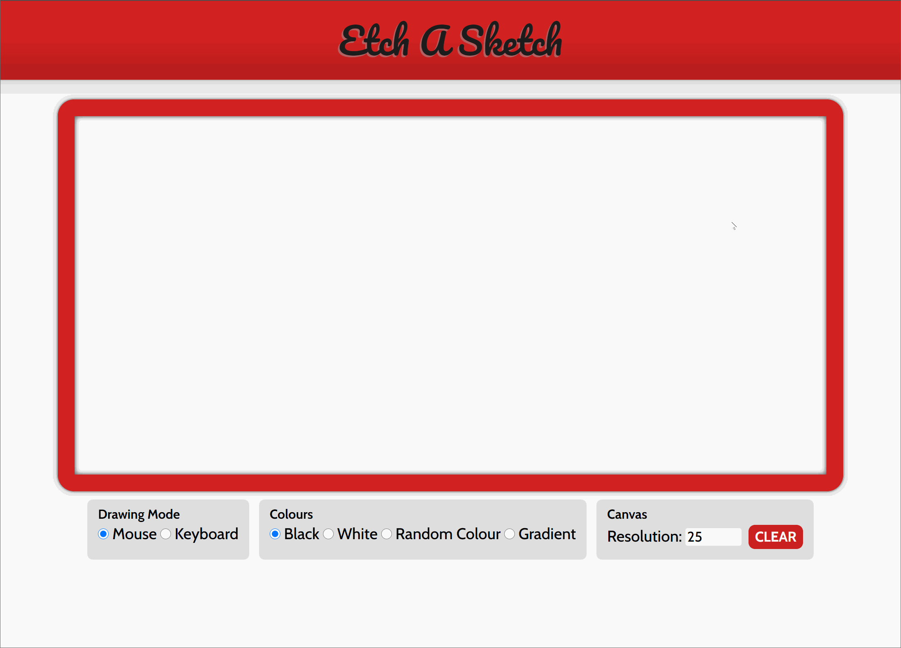

# etch-a-sketch
Etch-A-Sketch recreated in a website format.

This is an interactive recreation of Etch a Sketch built with HTML, CSS, and basic Javascript was created as part of project assignment for the Web Development 101 course by The Odin Project.

-Draw using keyboard inputs (use arrow keys or 'WASD' keys) or the mouse (by hovering over the canvas)

View live at: https://foolmonkey.github.io/etch-a-sketch/

Preview (GIF)
-----------

